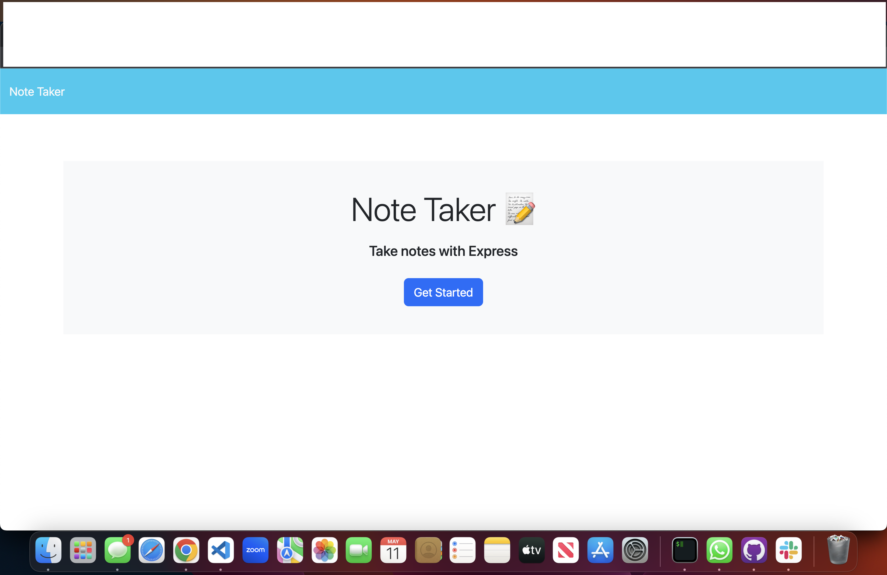
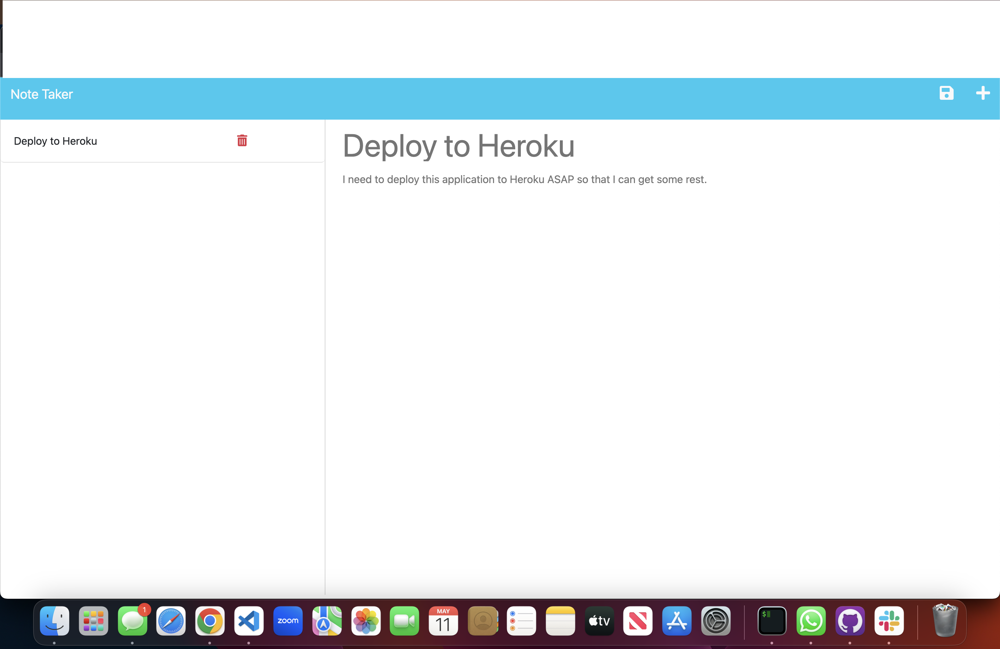

# Note-Taker

The Note-Taker application is a lightweight, easy-to-use application that allows the user to create, store, and delete personal notes.

## Installation

In order to install this application, you must first clone the following repository to your local machine: https://github.com/claxCode/note-taker . Once the necessary files have been imported to your machine, navigate to the directory containing the repository, and run `npm i` to download and install the package dependencies for this application. The dependencies included in the package.json file are Node.js and Express.js. 

## Usage

After the proper packages have been installed, run `npm start` to use Node.js to invoke our Express.js server, and the application will be live on your localhost:3001 URL by default. If the 3001 port is occupied, it will find another unused port. Use your web browser to view and interact with the application. After arriving at the root page, click "Get Started" to be routed to the notes page. Click on the "Note Title" text to assign a title to your note. After entering a title for your note, click on "Note Text" below to write the note itself. If the user wants to discard their note and start over, they may click the '+' button in the upper righthand corner. If the user is happy with their note, they can click the save button adjacent to the '+' sign to save the note. Saved notes will be displayed on the left side of the screen. Click on the saved note title to see the contents of the note. Click the red trash can button to delete your notes when you're through with them. Any time, click the "Note Taker" text in the upper lefthand corner to return to the index.html file.

## Screenshots

## Contact

For questions regarding this project, please feel free to contact me on LinkedIn at : <a href="https://www.linkedin.com/in/joshua-claxton-916a2a272/">this link</a>

